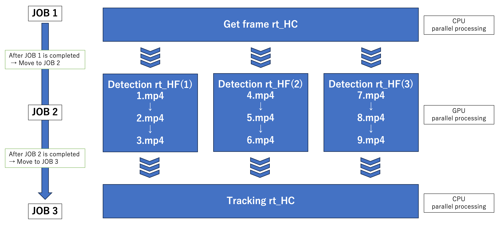
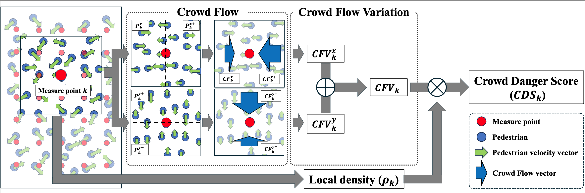

# Automatic Crowd Congestion Analysis System 


# Overall Pipeline


# Crowd Risk Analysis


# Setup environment

We utilize Miniconda to create the virtual environment and Python=3.10.  
The required packages are installed by executing `setup.sh`.

```bash
conda create -n <ENV_NAME> python=3.10
conda activate <ENV_NAME>

bash setup.sh
```

# Run Pipeline

## How to Run on ABCI

### Run on a Node (Interactive)
```bash
python run_job_hydra.py hydra.run.dir=<SAVE_DIR> settings.video_path=<PATH2VIDEO>
```

When running experiments via shell:
```bash
bash run_pipeline.sh <EXP_NAME> <PATH2VIDEO>
```

### Job Submission
```bash
qsub -v EXP_NAME={exp_name},VIDEO_PATH={video_path} run_pipeline.sh
```

### Configuration Descriptions

`run_job_hydra.py` uses the Hydra framework to manage configurations and execute the pipeline. Configuration files are located in the `conf/` directory.

`conf/config.yaml`: Main configuration file

`conf/execution/default.yaml`: Specifies the pipeline to execute

`conf/pipeline/default.yaml`: Defines execution scripts and input parameters for each step


## Output Directory Structure
```
SAVE_DIR/
├── .hydra/ 
├── results/
│   ├── img/                      # Frame images extracted from the video
│   ├── detection/           # Merged detection results for the whole 
│   ├── detection_vis/           # Visualization of detections
│   ├── track/
│   ├── track_vis/                    # Tracking results (ByteTrack output)
│   ├── crowd_risk_score/         # Output of crowd risk score
│   ├── risk_heatmap/             # Visualization of risk estimation
│   └── time_log.txt             # Log of processing time for each step
└── run_job_hydra.log  
```

## Parallel Processing
If you want to process multiple videos in parallel, configure `conf/config_parallel.yaml`, `conf/execution/parallel.yaml`, `conf/pipeline/parallel.yaml`, and `conf/io_info/parallel.yaml`, then run the following:
```bash
python run_job_hydra_parallel.py
```


# Details
## Head Detection (P2PNet)
P2PNet was proposed in the paper:
[Rethinking Counting and Localization in Crowds: A Purely Point-Based Framework (ICCV 2021)](https://openaccess.thecvf.com/content/ICCV2021/html/Song_Rethinking_Counting_and_Localization_in_Crowds_A_Purely_Point-Based_Framework_ICCV_2021_paper.html)
by Qingyu Song *et al.*
```
bash scripts/p2pnet/run_fullsize_inference_ddp.sh <WEIGHT_PATH> <IMG_DIR> <DET_OUT_DIR> <DET_DATA_DIR> <LOG_LEVEL>
```

## Head Tracking (ByteTrack)
ByteTrack was proposed in the paper:
[ByteTrack: Multi-Object Tracking by Associating Every Detection Box (ECCV 2022)](https://arxiv.org/abs/2110.06864)
by Zhang *et al.*
```
bash scripts/bytetrack/run_byte_track.sh <DET_DATA_DIR> <TRACK_DIR>
```

## Risk Estimation (Crowd Risk Score)
We proposed a quantitative metric for evaluating crowd-related risks.
[Quantifying Risk in Pedestrian Crowds Using Divergence Estimated from Flows of Head-Tracking Data (BMVC 2025)]()
by Haruto Nakayama *et al.*




```bash
bash scripts/crowd_risk_score/run_crs.sh <TRACK_DIR> <OUT_DIR> <BEV_FILE> <MAP_SIZE_FILE>
```

## Finetuning P2PNet

### Training

#### Local
Set train data in "datasets" directory and execute the following command.

```bash
python src/main.py p2p default.epochs=500 \
                        dataset.name=Dataset \
                        optimizer.batch_size.train=8 \
                        optimizer.batch_size.test=2 \
```
or 
```bash
bash scripts/run_train.sh <DATASET>
```

#### Tsukuba

Use `scripts/run_cotton.sh`.

If you don't use wandb, set default.wandb=False and ignore Project_name and Run_name.

#### ABCI

Use `scripts/abci_multi_node.sh`.

If you don't use wandb, set default.wandb=False and ignore Project_name and Run_name.

### Inference

```bash
python src/run_predict.py <Save_dir> <Weight_path> <Weight_name> <Dataset_name>
```

### Metric

```bash
python src/calc_metric.py <Save_dir> <Weight_path> <Weight_name> <Dataset_name>
```


### Visualization

```bash
python create_graph.py <Save_dir> <Source_dir> <Dataset_name> <Weight_name>
python create_mov.py <Save_dir> <Source_dir> <Dataset_name> <Weight_name>
python create_movie_graph.py <Save_dir> <Source_dir> <Dataset_name> <Weight_name>
```

If you want run all at once,
```bash
bash vis_codes/vis_scripts.sh <Weight_path> <Weight_name> <Dataset_name>
```

