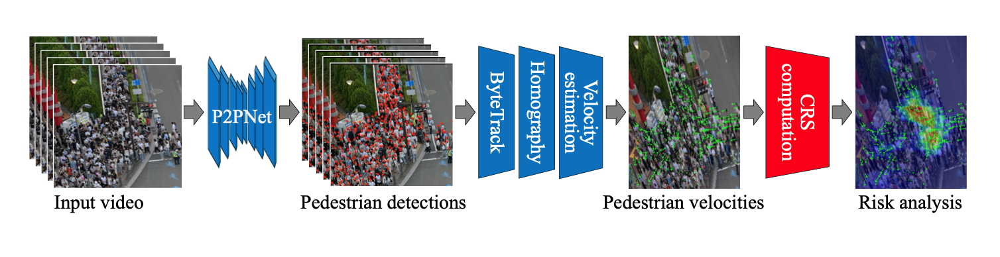
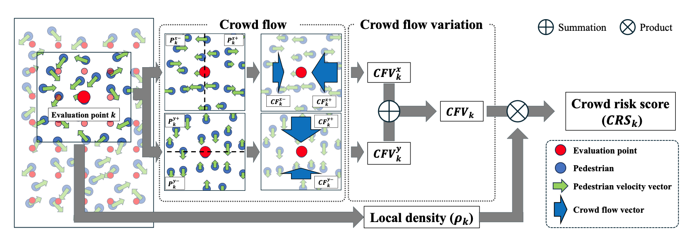

# Automatic Crowd Congestion Analysis System 


# Overall Pipeline


# Crowd Risk Analysis


# Setup environment

We utilize Miniconda to create the virtual environment and Python=3.10.  
The required packages are installed by executing `setup.sh`.

```bash
conda create -n <ENV_NAME> python=3.10
conda activate <ENV_NAME>

bash setup.sh
```

# Run Pipeline

## How to Run
```bash
bash run_pipeline.sh <PATH2VIDEO> <SAVE_DIR> <WEIGHT_PATH> <BEV_FILE> <SIZE_FILE>
```

### Variable Descriptions
- `PATH2VIDEO`: Path to the input video file
- `SAVE_DIR`: Root directory to save all output files and directories
- `WEIGHT_PATH`: Weight file for P2PNet
- `BEV_FILE`: Homography matrix file
- `SIZE_FILE`: Map size file after homography transformation

## Output Directory Structure
```
SAVE_DIR/
├── img/                      # Frame images extracted from the video
│   ├── 0001.png
│   ├── 0002.png
│   └── ...
├── patch_detection/          # Detection results for each patch (P2PNet output)
│   ├── 0001.txt
│   ├── 0002.txt
│   └── ...
├── full_detection/           # Merged detection results for the whole image
│   ├── 0001.txt
│   ├── 0002.txt
│   └── ...
├── detection_plot/           # Visualization of detections
├── track/                    # Tracking results (ByteTrack output)
│   ├── 0001.txt
│   ├── 0002.txt
│   └── ...
├── crowd_risk_score/         # Output of crowd risk score
├── risk_heatmap/             # Visualization of risk estimation
└── time_log.txt             # Log of processing time for each step
```

# Details
## Head Detection (P2PNet)
P2PNet was proposed in the paper:
[Rethinking Counting and Localization in Crowds: A Purely Point-Based Framework (ICCV 2021)](https://openaccess.thecvf.com/content/ICCV2021/html/Song_Rethinking_Counting_and_Localization_in_Crowds_A_Purely_Point-Based_Framework_ICCV_2021_paper.html)
by Qingyu Song *et al.*
```
cd p2pnet
bash scripts/run_inference.sh <OUT_DIR> <WEIGHT_PATH> <IMG_DIR>
```

## Head Tracking (ByteTrack)
ByteTrack was proposed in the paper:
[ByteTrack: Multi-Object Tracking by Associating Every Detection Box (ECCV 2022)](https://arxiv.org/abs/2110.06864)
by Zhang *et al.*
```
bash bytetrack/scripts/run_byte_track.sh <PLACE>
```

## Risk Estimation (Crowd Risk Score)
We proposed a quantitative metric for evaluating crowd-related risks.




```bash
bash crs/scripts/run_main.sh
```

## Finetuning P2PNet

### Training

#### Local
Set train data in "datasets" directory and execute the following command.

```bash
python src/main.py p2p default.epochs=500 \
                        dataset.name=Dataset \
                        optimizer.batch_size.train=8 \
                        optimizer.batch_size.test=2 \
```
or 
```bash
bash scripts/run_train.sh <DATASET>
```

#### Tsukuba

Use `scripts/run_cotton.sh`.

If you don't use wandb, set default.wandb=False and ignore Project_name and Run_name.

#### ABCI

Use `scripts/abci_multi_node.sh`.

If you don't use wandb, set default.wandb=False and ignore Project_name and Run_name.

### Inference

```bash
python src/run_predict.py <Save_dir> <Weight_path> <Weight_name> <Dataset_name>
```

### Metric

```bash
python src/calc_metric.py <Save_dir> <Weight_path> <Weight_name> <Dataset_name>
```


### Visualization

```bash
python create_graph.py <Save_dir> <Source_dir> <Dataset_name> <Weight_name>
python create_mov.py <Save_dir> <Source_dir> <Dataset_name> <Weight_name>
python create_movie_graph.py <Save_dir> <Source_dir> <Dataset_name> <Weight_name>
```

If you want run all at once,
```bash
bash vis_codes/vis_scripts.sh <Weight_path> <Weight_name> <Dataset_name>
```

